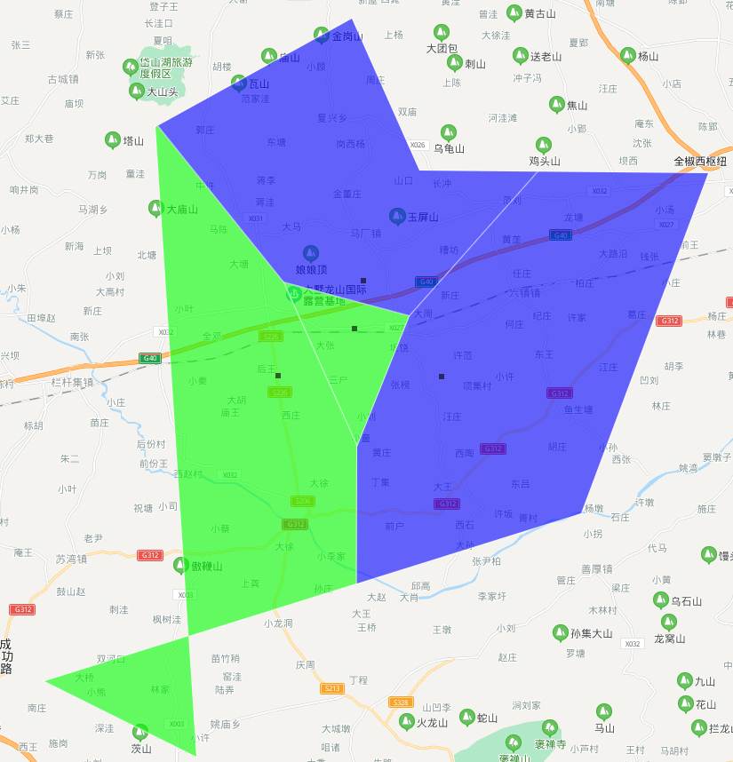
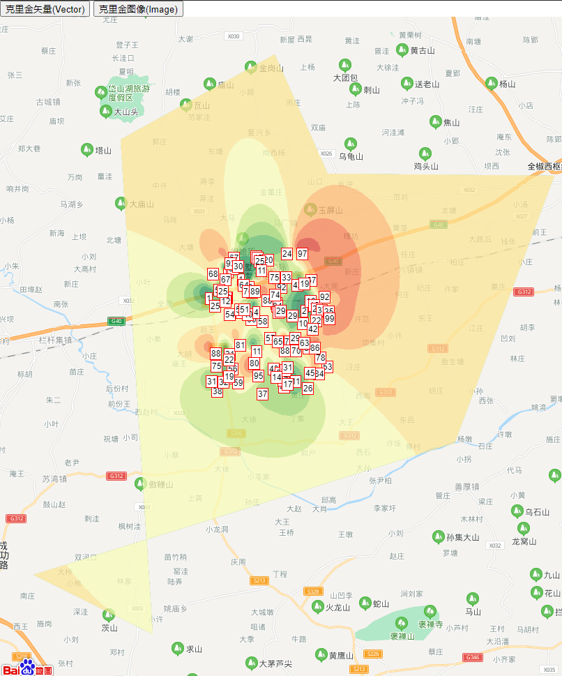
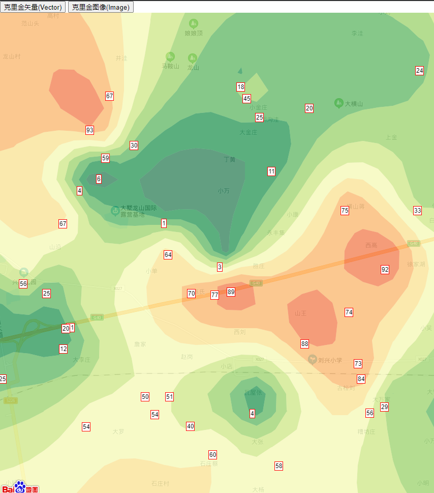
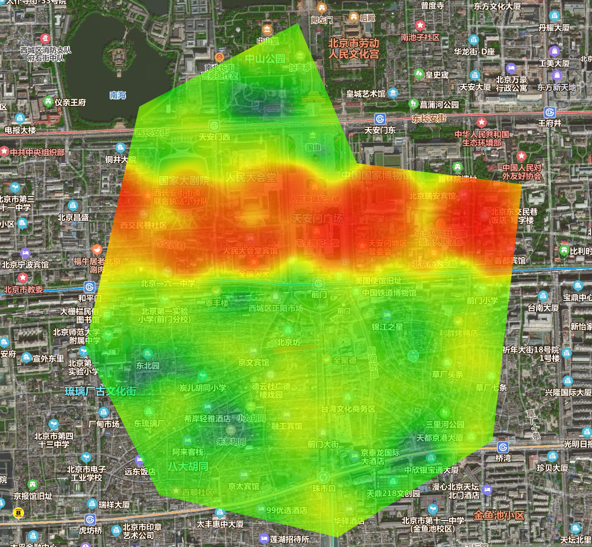

# GIS-Demo
记录一些GIS相关Demo

## 1. BaiduMap-Voronoi
计算泰森多边形(Voronoi diagram)，并在百度地图上绘制（边框可任意裁剪）  
算法参考：https://github.com/gorhill/Javascript-Voronoi

## 2. BaiduMap-Kriging-Contour
基于克里金(Kriging)插值算法，生成矢量等值面数据，并在百度地图上绘制呈现（边框可任意裁剪）  
算法参考：https://github.com/FreeGIS/kriging-contour
 

## 3. BaiduMap-Mapv
任意裁剪百度地图Mapv热力图  
Mapv参考：https://github.com/huiyan-fe/mapv
